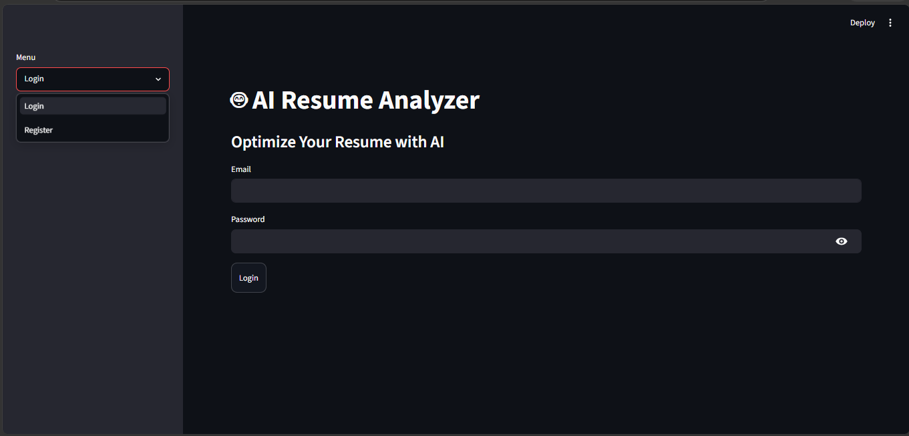
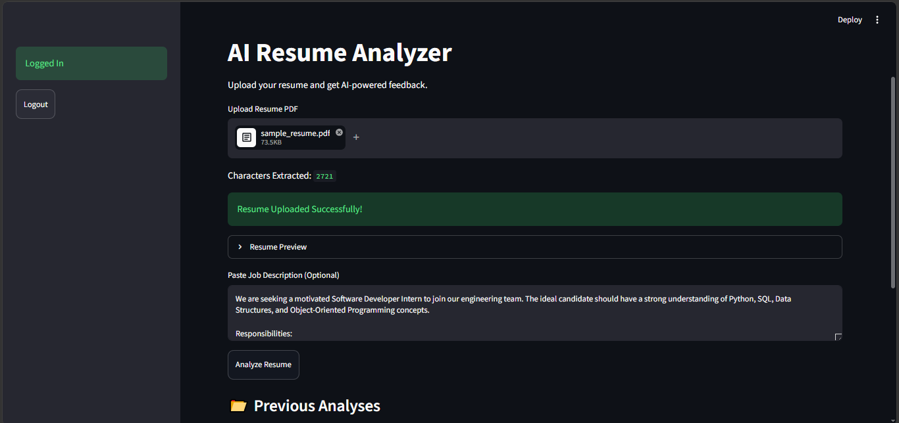
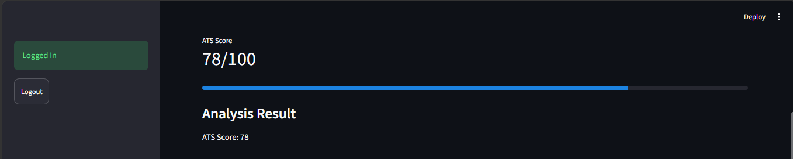
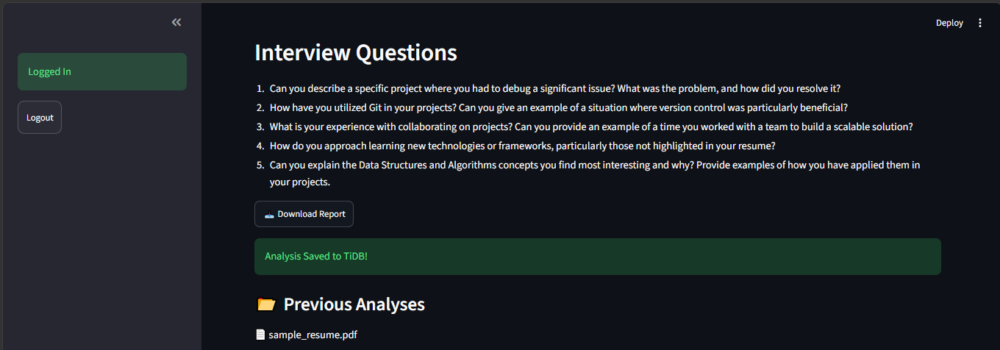

# AI Resume Analyzer

An AI-powered Resume Analyzer designed to help students and professionals optimize their resumes, improve ATS compatibility, identify skill gaps, and prepare for interviews with personalized AI-generated insights.

This project simulates how recruiters and Applicant Tracking Systems (ATS) evaluate resumes. Users can upload their resume in PDF format and receive a comprehensive analysis, including ATS scores, strengths, weaknesses, missing skills, and interview questions generated using advanced language models.

---

## Live Demo

Experience the AI Resume Analyzer directly in your browser without any installation.

Live Application: https://ai-resume-analyzer-tanuj.streamlit.app

Try it now to:

- Upload your resume in PDF format
- Receive AI-powered ATS analysis
- Identify strengths and weaknesses
- Detect missing skills
- Generate interview questions
- Download PDF reports
- View previous resume analyses

## Project Overview

In today's competitive job market, having a strong resume is crucial. Many candidates are rejected before reaching the interview stage because their resumes fail ATS screening or do not effectively highlight relevant skills.

The AI Resume Analyzer addresses this problem by providing intelligent feedback and actionable recommendations. By leveraging AI, the application empowers users to improve their resumes and prepare more confidently for job opportunities.

---

##  Features

###  User Authentication

* User Registration
* Secure Login System
* User-specific resume history

###  Resume Upload

* Upload resumes in PDF format
* Automatic resume text extraction using PyPDF2

### 🤖 AI-Powered Resume Analysis

* Analyze resume content using OpenRouter and GPT-4o-mini
* Evaluate the overall quality of the resume

###  ATS Score Generation

* Simulates Applicant Tracking System evaluation
* Provides an ATS compatibility score

###  Strengths Detection

Identifies positive aspects of the resume, such as:

* Relevant technical skills
* Strong educational background
* Effective project descriptions
* Certifications and achievements

###  Weakness Identification

Highlights areas requiring improvement, including:

* Missing details
* Weak summaries
* Poor formatting indicators
* Lack of measurable achievements

###  Missing Skills Detection

Detects skills commonly expected by recruiters but absent from the resume.

###  Interview Question Generation

Generates personalized interview questions based on the uploaded resume to help users prepare effectively.

###  Resume Analysis History

Stores previous analyses for users to review and compare.

###  Database Integration

Supports persistent data storage using:

* TiDB Cloud
* MySQL (if configured)

###  PDF Report Generation

Allows users to download analysis reports for future reference.

---

##  Tech Stack

### Frontend

* Streamlit

### Backend

* Python

### Artificial Intelligence

* OpenRouter API
* GPT-4o-mini

### Database

* TiDB Cloud
* MySQL

### Libraries Used

* PyPDF2
* SQLAlchemy
* python-dotenv
* Streamlit

---

##  Project Structure

AI_Resume_Analyzer/
├── app.py                  # Main Streamlit application
├── auth.py                 # Authentication logic
├── db_setup.py             # Database setup and operations
├── check_env.py            # Environment variable validation
├── requirements.txt        # Project dependencies
├── README.md               # Project documentation
├── .gitignore              # Ignored files configuration
└── screenshots/            # Application screenshots

---

##  Installation Guide

### 1. Clone the Repository

git clone https://github.com/TanujPatel45/AI_Resume_Analyzer.git

### 2. Navigate to the Project Directory

cd AI_Resume_Analyzer

### 3. Create a Virtual Environment

python -m venv venv

### 4. Activate the Virtual Environment

For Windows:

venv\Scripts\activate

### 5. Install Dependencies

pip install -r requirements.txt

### 6. Configure Environment Variables

Create a `.env` file and add your credentials:

OPENROUTER_API_KEY=your_api_key
DB_HOST=your_database_host
DB_USER=your_database_username
DB_PASSWORD=your_database_password
DB_NAME=your_database_name

### 7. Run the Application

streamlit run app.py

---

##  Screenshots

Add screenshots of the following pages:

### Login Page

### Resume Upload Interface

### ATS Analysis Result

### Interview Questions

---

## Future Enhancements

The following features are planned for future development:

* Job Description Matching
* Resume Match Percentage
* Resume Rewriting Suggestions
* Resume Comparison Tool
* Interactive Analytics Dashboard
* Multi-format Resume Support
* Email-Based Resume Reports

---

## Use Cases

This application can be useful for:

* Students preparing for internships
* Fresh graduates entering the job market
* Professionals seeking career transitions
* Individuals improving ATS compatibility
* Interview preparation

---

## Learning Outcomes

Through this project, the following concepts were explored and implemented:

* Python Application Development
* Streamlit UI Development
* Authentication Systems
* PDF Processing
* Database Integration
* API Integration
* Prompt Engineering
* AI-Based Text Analysis
* Version Control using Git and GitHub

---

## Contributing

Contributions, suggestions, and improvements are welcome.

Feel free to fork this repository and submit pull requests.

---

## Disclaimer

This application provides AI-generated insights intended to assist users in improving their resumes. Results should be considered guidance and not a guarantee of interview success or hiring outcomes.

---

## Author

**Tanuj Patel**

B.Tech Computer Engineering Student

GitHub: https://github.com/TanujPatel45

---

## Support

If you found this project helpful, consider giving it a star ⭐ on GitHub. It motivates further development and helps others discover the project.
